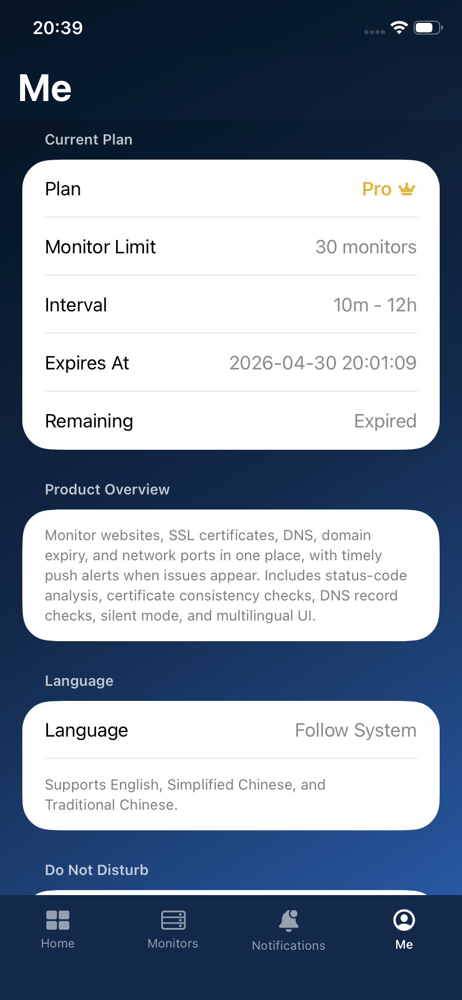

# OpsHome NOC

**Home Network Monitor & Alerts**

For homelab, home servers, personal sites, and always-on services.

 

[App Store](https://apps.apple.com/us/app/opshome-noc/id6763890679) · [Privacy Policy](privacy.html) · [Terms of Service](terms.html)

---

## Overview

**OpsHome NOC** helps you monitor the availability of home servers, self-hosted services, personal websites, SSL certificates, DNS records, ports, and domain-related resources.

It is designed for users who run homelabs, NAS devices, reverse proxies, home servers, personal projects, or small self-hosted services and want to know quickly when something goes offline.

OpsHome NOC performs active cloud-based checks and sends push alerts to your iPhone when a service goes down or recovers.

## Key Features

- Instant push alerts when a monitored service goes down or recovers
- Multiple monitor types for common homelab and website scenarios
- Health dashboard with uptime status and recent activity
- SSL certificate monitoring for expiry visibility
- Event history for reviewing past incidents
- Analysis reports to help understand monitor failures
- Sign in with Apple for simple and secure authentication
- Privacy-focused design with minimal data collection

## Monitor Types

| Monitor Type | Description | Availability |
| --- | --- | --- |
| HTTP | Website reachability and status code detection | Free / Pro |
| HTTPS | HTTPS reachability with certificate validation | Free / Pro |
| TCP | IP and port connectivity checks | Free / Pro |
| SSL Expiry | SSL certificate remaining validity checks | Free / Pro |
| ICMP Ping | Host reachability checks | Free / Pro |
| UDP | UDP response checks | Pro |
| DNS | DNS resolution checks | Pro |
| Domain Expiry | Domain expiration tracking | Pro |

## Plans

| Feature | Free | Pro |
| --- | --- | --- |
| Monitor targets | 15 | 80 |
| Supported protocols | HTTP, HTTPS, TCP, SSL, ICMP | All monitor types |
| Check interval | 10 min - 1 hr | 5 min - 1 hr |
| Event history | 14 days | 90 days |
| Push alert notifications | Included | Included |
| Expiry reminders | Not included | Included |
| Analysis report | Basic | Full |

Subscriptions are billed through Apple In-App Purchase. Final prices and local currency are shown by the App Store before purchase.

## Screenshots

  
  
  
  

## App Store

OpsHome NOC is available on the App Store:

https://apps.apple.com/us/app/opshome-noc/id6763890679

## Privacy

OpsHome NOC is designed to collect only the data required to provide monitoring and alerting functionality.

- No advertising profile
- No sale of personal data
- No unnecessary location or contact access
- API keys and tokens are stored securely in iOS Keychain

For details:

- [Privacy Policy](privacy.html)
- [Terms of Service](terms.html)

## Contact

For support or questions:

**opshome@outlook.com**

---

© 2026 OpsHome NOC. All rights reserved.

