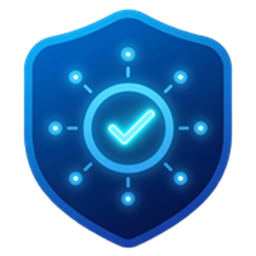
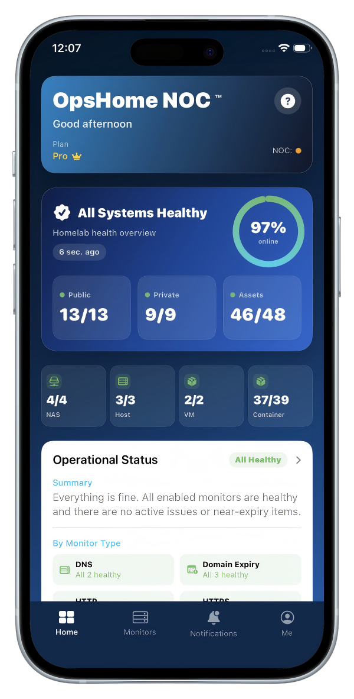
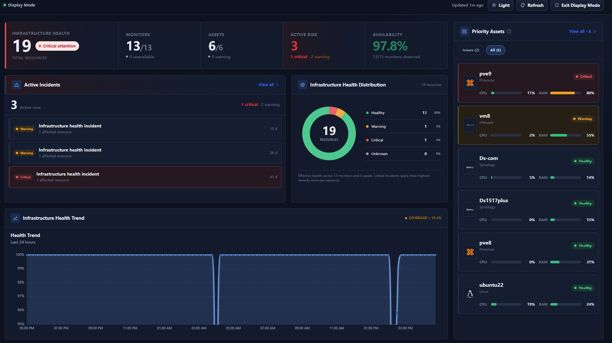

# OpsHome NOC

**Mobile + Web NOC for self-hosted infrastructure**  
**面向自托管基础设施的移动端 + Web NOC**  
**面向自架基礎設施的行動端 + Web NOC**

Monitor public services, private networks, Proxmox, VMware, Synology, Linux, Docker, websites, SSL, domains, incidents, and infrastructure health from one operational view.

 

 

  

 

[Website](https://app.opshome.run) · [Console](https://console.opshome.run) · [Documentation](https://docs.opshome.run) · [App Store](https://apps.apple.com/us/app/opshome-noc/id6763890679) · [Security](https://app.opshome.run/security.html) · [Support](https://app.opshome.run/support.html)

---

## Overview

**OpsHome NOC** is a lightweight operations platform for homelabs, self-hosted services, NAS environments, and small always-on infrastructure.

It combines an **iPhone-first NOC app** with a **read-only Web Console**, so the same environment can be reviewed from a phone, desktop browser, tablet, or wall display.

OpsHome brings together:

- Public service monitoring from OpsHome Cloud
- Private network monitoring through Docker Probe
- Infrastructure visibility for Proxmox VE, VMware vSphere, Synology NAS, Linux, and Docker
- Current health, availability, utilization, storage, workload, and event context
- Incident workspace and recovery history
- Public status pages
- Push notifications and supported alert integrations
- Sign in with Apple

OpsHome is designed for people who want a clear operational view without turning their monitoring system into another infrastructure project to maintain.

## Key Capabilities

### Public Monitoring

Monitor internet-facing services and infrastructure from OpsHome Cloud:

- HTTP / HTTPS
- TCP / UDP
- ICMP
- SSL certificates
- DNS
- Domain expiry
- Websites and APIs

### Private Monitoring

Docker Probe runs inside an authorized private network and connects outbound to OpsHome Cloud.

This allows you to monitor private services without exposing internal management interfaces to the public internet.

- Private HTTP / HTTPS / TCP monitoring
- No inbound port forwarding required
- No public management interface required
- Works behind NAT and home routers
- Supports private infrastructure assets reachable by the Probe

### Infrastructure Visibility

OpsHome can bring heterogeneous infrastructure into the same operational view:

- **Proxmox VE** — nodes, VMs, LXC guests, storage, resource usage, health, and workload context
- **VMware vSphere** — hosts, virtual machines, datastores, performance, and health context
- **Synology NAS** — system status, storage, disks, utilization, temperature, network, and supported container data
- **Linux** — host health and resource visibility
- **Docker** — hosts, containers, state, and supported container events

### Incidents and Events

OpsHome keeps more than the current green/red state visible.

Supported views can include:

- Active and recovered incidents
- Severity and duration
- Affected monitors or assets
- Evidence and event timelines
- Container restarts and recoveries
- Abnormal container states
- Container exits, recreations, and OOM kills
- Historical monitoring context

## OpsHome Console

**OpsHome Console** is the browser-based, read-only operations view for your existing OpsHome environment.

Open it at: **https://console.opshome.run**

Current Console capabilities include:

- Overview of environment health and active risk
- Monitor Matrix for public and private monitoring
- Assets Topology for infrastructure health and workloads
- Incident Workspace with evidence and history
- Light and dark themes
- Responsive layouts for desktop, iPad, and mobile browsers
- Wall Display Mode for long-running operational visibility
- Sign in with Apple
- Read-only access by design

The Console is intended for observation and investigation. It does not turn the browser into a remote infrastructure administration panel.

## Docker Probe Security Model

Docker Probe is designed to preserve the private-network boundary.

- The Probe runs inside the network it is authorized to observe.
- It initiates outbound HTTPS connections to OpsHome Cloud.
- OpsHome Cloud does not directly initiate connections into your LAN.
- No inbound firewall rule or public port forwarding is required for normal Probe operation.
- Private infrastructure can remain behind the local firewall or router.
- Use dedicated or least-privilege credentials where supported.

OpsHome processes operational monitoring data required to provide health, event, asset, and alerting functionality. It is not designed to upload personal NAS files, documents, or unrelated private content.

For the current public security controls, see the [Security page](https://app.opshome.run/security.html).

## Security

OpsHome follows a layered security model built around:

- Encrypted communications
- Protected handling of supported sensitive credentials
- Outbound-initiated private monitoring through Docker Probe
- Least-privilege guidance for Asset Sources
- User-controlled monitoring scope
- Verifiable release integrity

Security controls evolve with the service. Refer to the live [Security page](https://app.opshome.run/security.html) for the current public security statement and verification guidance.

## Plans & Founder Benefits

OpsHome has **three plans — Free, Pro, and Studio — plus a permanent Founder Benefit for eligible early accounts**.

Founder is **not a separate subscription plan**. It is a permanent account entitlement that increases the Free allowance for eligible early accounts.

### Core Allowances

| Capability | Regular Free | Founder | Pro | Studio |
| --- | ---: | ---: | ---: | ---: |
| Public Monitors | 30 | 30 | 100 | 250 |
| Docker Probes | 1 Synology | 3 Synology | 12 multi-platform | 25 multi-platform |
| Asset Sources | Synology Assets | Synology Assets | 12 | 25 |
| Private Monitors | 2 | 6 | 50 | 150 |
| Public Status Pages | 1 | 1 | 3 | 5 |
| Minimum Public Check Interval | 10 min | 10 min | 3 min | 3 min |

### Free

Regular Free accounts include:

- 30 Public Monitors
- HTTP / HTTPS / TCP / SSL / ICMP monitoring
- 1 Synology Docker Probe
- Synology Assets
- 2 Private Monitors
- 1 public status page
- Push alerts and SSL expiry reminders
- Visual monitoring dashboard

### Founder Benefit

Eligible accounts registered before **May 1, 2027** receive a permanent Founder entitlement:

- 30 Public Monitors
- 3 Synology Docker Probes
- Synology Assets
- 6 Private Monitors
- 1 public status page

Founder access remains attached to the eligible account. If a Founder account subscribes to Pro or Studio and that subscription later expires, the account returns to its Founder allowance. An account without Founder eligibility returns to Regular Free limits.

### Pro

Pro expands the environment limits to:

- 100 Public Monitors
- All supported public monitor types, including UDP, DNS, and Domain
- 12 multi-platform Docker Probes
- 12 Asset Sources
- 50 Private Monitors
- 3 public status pages
- 3-minute minimum public check interval
- Expanded private infrastructure capabilities
- Push + Telegram alerts

### Studio

Studio includes all Pro capabilities and expands the limits to 250 Public Monitors, 25 multi-platform Docker Probes, 25 Asset Sources, 150 Private Monitors, and 5 public status pages. The minimum public check interval remains 3 minutes, with up to 20 monitors per status page.

Plan limits, pricing, and commercial terms can evolve. The live website and App Store purchase screen are the source of truth for current pricing and entitlements.

See: [Pricing](https://app.opshome.run/#pricing)

## Public Status Pages

OpsHome can publish selected service information to a lightweight public status page.

Status pages can show:

- Current service state
- Latest check information
- 24-hour, 7-day, and 30-day uptime summaries
- Response-time information
- Recent incidents and recovery context
- Shareable links and QR codes

Public status pages are designed to expose selected service status without exposing internal operational details such as private IP addresses, hostnames, internal URLs, API keys, Probe identifiers, or sensitive paths.

Learn more: [Status Pages](https://app.opshome.run/status-pages/)

## Quick Start

1. Install OpsHome NOC from the App Store.
2. Sign in with Apple.
3. Add a public monitor for a website, API, certificate, port, or domain-related target.
4. Deploy Docker Probe for private or internal services.
5. Add supported Asset Sources such as Proxmox, VMware, Synology, Linux, or Docker.
6. Enable notifications.
7. Review monitors, assets, incidents, history, and availability from the iPhone app.
8. Open OpsHome Console when you need a larger read-only operational view.

A useful first setup is one public HTTPS monitor plus one private Docker Probe target. This helps distinguish external availability from internal service health.

## Documentation

- [Documentation Home](https://docs.opshome.run)
- [Quick Start](https://docs.opshome.run/quick-start.html)
- [Cloud Monitoring](https://docs.opshome.run/cloud-monitoring.html)
- [Docker Probe](https://app.opshome.run/docker-probe/)
- [Private Monitoring](https://app.opshome.run/private-monitoring/)
- [Homelab / Infrastructure](https://app.opshome.run/homelab-noc/)
- [Proxmox Monitoring](https://app.opshome.run/proxmox-monitoring/)
- [Synology Monitoring](https://app.opshome.run/synology-monitoring/)
- [Linux Server Monitoring](https://app.opshome.run/linux-server-monitoring/)
- [Docker Container Monitoring](https://app.opshome.run/docker-container-monitoring/)
- [Status Pages](https://app.opshome.run/status-pages/)
- [Console](https://app.opshome.run/console/)
- [Security](https://app.opshome.run/security.html)
- [Support](https://app.opshome.run/support.html)

## Languages

The OpsHome website currently provides:

- English
- 简体中文
- 繁體中文
- Deutsch

The product interface and documentation may have different language coverage depending on version and platform.

---

## 简体中文

### 产品简介

**OpsHome NOC** 是面向 Homelab、自托管服务、NAS 和小型长期运行基础设施的轻量 NOC 平台。

现在的 OpsHome 不再局限于 iPhone 单一界面，而是由 **iOS App + 只读 Web Console + OpsHome Cloud + Docker Probe** 组成统一的监控体验。

它可以把以下内容放到同一个运维视图中：

- 公网网站、API、SSL、DNS、域名和网络端点监控
- 通过 Docker Probe 进行的私有网络监控
- Proxmox VE、VMware vSphere、Synology NAS、Linux 和 Docker 基础设施
- 当前健康状态、可用率、资源使用、存储与工作负载信息
- 活跃和已恢复的 Incidents
- 事件和证据时间线
- 推送通知与支持的告警集成
- 公共状态页
- Sign in with Apple

### Web Console

**OpsHome Console** 提供与 iOS App 同一账号下的只读 Web 运维视图：

- Overview
- Monitor Matrix
- Assets Topology
- Incident Workspace
- Light / Dark Theme
- Wall Display Mode
- Desktop / iPad / Mobile 响应式布局

Console 地址：**https://console.opshome.run**

Console 主要用于观察、排查和大屏展示，不用于远程修改或控制基础设施。

### 私有网络监控

Docker Probe 部署在你授权的私有网络中，并主动通过 HTTPS 连接 OpsHome Cloud。

正常使用不需要：

- 开放入站端口
- 暴露家庭公网 IP
- 为内部管理界面配置公网反向代理

这样可以在保留私有网络边界的同时，查看内部 HTTP / HTTPS / TCP 服务以及受支持的基础设施状态。

### 当前支持的基础设施

- **Proxmox VE**：节点、VM、LXC、存储、资源使用和健康信息
- **VMware vSphere**：主机、虚拟机、数据存储、性能和健康信息
- **Synology NAS**：系统、存储、磁盘、资源、温度、网络和支持的容器信息
- **Linux**：主机资源和健康信息
- **Docker**：主机、容器、状态和支持的容器事件

### 方案与 Founder 权益

OpsHome 当前有 **Free / Pro / Studio 三档方案**，同时为符合条件的早期账号提供永久 **Founder 权益**。

Founder **不是单独的订阅方案**，而是附加在符合条件账号上的永久权益。Founder 账号即使没有有效 Pro 或 Studio 订阅，也会保留高于普通 Free 的基础额度。

| 能力 | 普通 Free | Founder | Pro | Studio |
| --- | ---: | ---: | ---: | ---: |
| 公网监控 | 30 | 30 | 100 | 250 |
| Docker Probe | 1 个群晖 | 3 个群晖 | 12 个全平台 | 25 个全平台 |
| 资产源 | 群晖资产 | 群晖资产 | 12 | 25 |
| Private Monitor | 2 | 6 | 50 | 150 |
| 公开状态页 | 1 | 1 | 3 | 5 |
| 公网最短检查间隔 | 10 分钟 | 10 分钟 | 3 分钟 | 3 分钟 |

在 **2027 年 5 月 1 日前**符合条件完成注册的 Founder 账号，可永久保留：

- 30 个公网监控
- 3 个群晖 Docker Probe
- 群晖资产
- 6 个 Private Monitor
- 1 个公开状态页

如果 Founder 账号之后订阅 Pro 或 Studio，在订阅到期或取消后，账号会回到 **Founder 权益额度**；不具备 Founder 资格的账号会恢复到普通 Free 额度。Studio 每个状态页最多包含 20 个监控点。

价格、额度和权益可能随着产品调整，请以 [官网 Pricing](https://app.opshome.run/#pricing) 和 App Store 购买页面为准。

### 快速开始

1. 从 App Store 安装 OpsHome NOC。
2. 使用 Sign in with Apple 登录。
3. 创建公网 Monitor。
4. 如需监控私有网络，部署 Docker Probe。
5. 添加 Proxmox、VMware、Synology、Linux 或 Docker 等支持的资产源。
6. 开启通知。
7. 在 iPhone 上查看健康、事件和 Incidents。
8. 需要更大屏幕时打开 OpsHome Console。

---

## 繁體中文

### 產品簡介

**OpsHome NOC** 是面向 Homelab、自架服務、NAS 與小型長時間運行基礎設施的輕量 NOC 平台。

目前 OpsHome 由 **iOS App + 唯讀 Web Console + OpsHome Cloud + Docker Probe** 組成統一的監控體驗。

它可以把以下內容整合到同一個運維視圖：

- 公網網站、API、SSL、DNS、網域與網路端點監控
- 透過 Docker Probe 進行的私有網路監控
- Proxmox VE、VMware vSphere、Synology NAS、Linux 與 Docker 基礎設施
- 目前健康狀態、可用率、資源使用、儲存與工作負載資訊
- 活躍與已恢復的 Incidents
- 事件與證據時間軸
- 推播通知與支援的告警整合
- 公開狀態頁
- Sign in with Apple

### Web Console

**OpsHome Console** 提供與 iOS App 相同帳號下的唯讀 Web 運維視圖：

- Overview
- Monitor Matrix
- Assets Topology
- Incident Workspace
- Light / Dark Theme
- Wall Display Mode
- Desktop / iPad / Mobile 響應式版面

Console：**https://console.opshome.run**

Console 主要用於觀察、調查與大螢幕顯示，不用於遠端修改或控制基礎設施。

### 私有網路監控

Docker Probe 部署在你授權的私有網路內，並主動透過 HTTPS 連線 OpsHome Cloud。

正常使用不需要：

- 開放入站連接埠
- 暴露家庭公網 IP
- 將內部管理介面放到公開反向代理後方

這樣可以保留私有網路邊界，同時查看內部 HTTP / HTTPS / TCP 服務與支援的基礎設施狀態。

### 目前支援的基礎設施

- **Proxmox VE**：節點、VM、LXC、儲存、資源使用與健康資訊
- **VMware vSphere**：主機、虛擬機、資料存放區、效能與健康資訊
- **Synology NAS**：系統、儲存、硬碟、資源、溫度、網路與支援的容器資訊
- **Linux**：主機資源與健康資訊
- **Docker**：主機、容器、狀態與支援的容器事件

### 方案與 Founder 權益

OpsHome 目前有 **Free / Pro / Studio 三種方案**，同時為符合條件的早期帳號提供永久 **Founder 權益**。

Founder **不是獨立的訂閱方案**，而是附加在符合條件帳號上的永久權益。Founder 帳號即使沒有有效 Pro 或 Studio 訂閱，也會保留高於一般 Free 的基礎額度。

| 能力 | 一般 Free | Founder | Pro | Studio |
| --- | ---: | ---: | ---: | ---: |
| 公網監控 | 30 | 30 | 100 | 250 |
| Docker Probe | 1 個群暉 | 3 個群暉 | 12 個全平台 | 25 個全平台 |
| 資產來源 | 群暉資產 | 群暉資產 | 12 | 25 |
| Private Monitor | 2 | 6 | 50 | 150 |
| 公開狀態頁 | 1 | 1 | 3 | 5 |
| 公網最短檢查間隔 | 10 分鐘 | 10 分鐘 | 3 分鐘 | 3 分鐘 |

在 **2027 年 5 月 1 日前**符合條件完成註冊的 Founder 帳號，可永久保留：

- 30 個公網監控
- 3 個群暉 Docker Probe
- 群暉資產
- 6 個 Private Monitor
- 1 個公開狀態頁

如果 Founder 帳號之後訂閱 Pro 或 Studio，在訂閱到期或取消後，帳號會回到 **Founder 權益額度**；不具備 Founder 資格的帳號會恢復到一般 Free 額度。Studio 每個狀態頁最多包含 20 個監控點。

價格、額度與權益可能隨產品調整，請以 [官網 Pricing](https://app.opshome.run/#pricing) 與 App Store 購買頁面為準。

### 快速開始

1. 從 App Store 安裝 OpsHome NOC。
2. 使用 Sign in with Apple 登入。
3. 建立公網 Monitor。
4. 如需監控私有網路，部署 Docker Probe。
5. 新增 Proxmox、VMware、Synology、Linux 或 Docker 等支援的資產來源。
6. 開啟通知。
7. 在 iPhone 上查看健康、事件與 Incidents。
8. 需要更大的畫面時開啟 OpsHome Console。

---

## Deutsch

### Kurzüberblick

**OpsHome NOC** ist eine leichte NOC-Plattform für Homelabs, Self-Hosting, NAS-Systeme und kleine dauerhaft betriebene Infrastrukturen.

Die Plattform verbindet:

- iOS-App für mobile Überwachung und Benachrichtigungen
- Read-only Web Console für Desktop, Tablet und Wall Display
- Öffentliches Monitoring über OpsHome Cloud
- Privates Monitoring über Docker Probe
- Infrastrukturansichten für Proxmox VE, VMware vSphere, Synology NAS, Linux und Docker
- Incidents, Ereignisse, Wiederherstellungen und Verlauf
- Öffentliche Statusseiten
- Sign in with Apple

### Web Console

Die **OpsHome Console** bietet eine schreibgeschützte Web-Ansicht für dasselbe OpsHome-Konto.

Aktuelle Bereiche umfassen:

- Overview
- Monitor Matrix
- Assets Topology
- Incident Workspace
- Light / Dark Theme
- Wall Display Mode
- Responsive Darstellung für Desktop, iPad und mobile Browser

Console: **https://console.opshome.run**

### Privates Monitoring

Docker Probe läuft innerhalb des autorisierten privaten Netzwerks und baut die Verbindung zu OpsHome Cloud **ausgehend über HTTPS** auf.

Für die normale Nutzung sind keine eingehenden Portfreigaben und keine öffentlich erreichbaren internen Management-Oberflächen erforderlich.

### Infrastruktur

Unterstützte Infrastruktur umfasst:

- **Proxmox VE**
- **VMware vSphere**
- **Synology NAS**
- **Linux**
- **Docker**

### Tarife und Founder-Vorteil

OpsHome hat **drei Tarife — Free, Pro und Studio — sowie einen dauerhaften Founder-Vorteil für berechtigte frühe Konten**.

Founder ist **kein eigenständiger Abonnement-Tarif**, sondern ein dauerhaftes Konto-Entitlement.

| Funktion | Regulär Free | Founder | Pro | Studio |
| --- | ---: | ---: | ---: | ---: |
| Public Monitors | 30 | 30 | 100 | 250 |
| Docker Probes | 1 Synology | 3 Synology | 12 plattformübergreifend | 25 plattformübergreifend |
| Asset-Quellen | Synology Assets | Synology Assets | 12 | 25 |
| Private Monitors | 2 | 6 | 50 | 150 |
| Öffentliche Statusseiten | 1 | 1 | 3 | 5 |
| Kürzestes öffentliches Prüfintervall | 10 Min. | 10 Min. | 3 Min. | 3 Min. |

Berechtigte Konten, die vor dem **1. Mai 2027** registriert werden, behalten dauerhaft:

- 30 Public Monitors
- 3 Synology Docker Probes
- Synology Assets
- 6 Private Monitors
- 1 öffentliche Statusseite

Wenn ein Founder-Konto später Pro oder Studio abonniert und das Abonnement anschließend endet, fällt das Konto auf die **Founder-Grenzen** zurück. Ein Konto ohne Founder-Berechtigung kehrt zu den regulären Free-Grenzen zurück. Studio erlaubt bis zu 20 Monitore pro Statusseite.

Aktuelle Preise und Bedingungen: [Pricing](https://app.opshome.run/#pricing)

Website: **https://app.opshome.run**

Dokumentation: **https://docs.opshome.run**

---

## Privacy

OpsHome is designed to process the information required to provide monitoring, health, incident, asset, and alerting functionality.

- No advertising profile
- No sale of personal data
- No unnecessary access to contacts
- Supported authentication data is protected using platform security mechanisms
- Docker Probe uses an outbound-initiated connection model
- Public status pages are designed to mask private infrastructure details

For current details:

- [Privacy Policy](https://app.opshome.run/privacy.html)
- [Terms of Service](https://app.opshome.run/terms.html)
- [Security](https://app.opshome.run/security.html)

## Support

For product support, account questions, or security-related contact:

**support@opshome.run**

- [Support Center](https://app.opshome.run/support.html)
- [Documentation](https://docs.opshome.run)

---

© 2026 OpsHome NOC™. All rights reserved.

