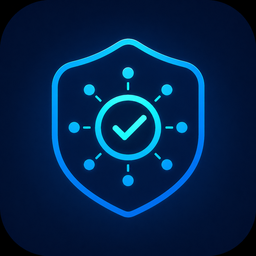

# OpsHome NOC

**Mobile + Web NOC for self-hosted infrastructure**  
**面向自托管基础设施的移动端 + Web NOC**  
**面向自架基礎設施的行動端 + Web NOC**

Monitor public services, private networks, Proxmox, VMware, Synology, Linux, Docker, websites, SSL, domains, incidents, and infrastructure health from one operational view.

[Website](https://app.opshome.run) · [Console](https://console.opshome.run) · [Documentation](https://docs.opshome.run) · [App Store](https://apps.apple.com/us/app/opshome-noc/id6763890679) · [Security](https://app.opshome.run/security.html) · [Support](https://app.opshome.run/support.html)

---

## Overview

**OpsHome NOC** is a lightweight operations platform for homelabs, self-hosted services, NAS environments, and small always-on infrastructure.

It combines an iPhone-first NOC app with a read-only Web Console, bringing together:

- Public service monitoring from OpsHome Cloud
- Private network monitoring through Docker Probe
- Asset visibility for Proxmox VE, VMware vSphere, Synology NAS, Linux, and Docker
- Health, availability, utilization, storage, workload, and event context
- Incident workspace and recovery history
- Public status pages
- Push notifications and supported alert integrations
- Sign in with Apple

## How OpsHome Works

| Product component | Purpose | Examples |
| --- | --- | --- |
| **OpsHome Cloud** | Public monitoring and account services | HTTP, HTTPS, TCP, UDP, SSL, DNS, ICMP, domain expiry, alerts, status pages |
| **Docker Probe** | Private monitoring from inside your network | Internal services and private assets behind NAT |
| **Asset Sources** | Asset and workload visibility | Proxmox VE, VMware vSphere, Synology NAS, Linux, Docker |
| **OpsHome NOC for iOS** | Mobile monitoring and alerts | Health, monitors, assets, incidents, notifications, status pages |
| **OpsHome Console** | Read-only browser operations view | Monitor Matrix, Assets Topology, Incident Workspace, Wall Display Mode |

## Key Capabilities

### Public Monitoring

- HTTP / HTTPS
- TCP / UDP
- ICMP
- SSL certificates
- DNS
- Domain expiry
- Websites and APIs

### Private Monitoring

Docker Probe runs inside an authorized private network and initiates outbound connections to OpsHome Cloud. Normal operation does not require inbound port forwarding or a publicly exposed management interface.

### Asset Visibility

- **Proxmox VE** — nodes, VMs, LXC guests, storage, utilization, and health
- **VMware vSphere** — hosts, virtual machines, datastores, performance, and health
- **Synology NAS** — system status, storage, disks, utilization, temperature, network, and supported container data
- **Linux** — host health and resource visibility
- **Docker** — hosts, containers, state, and supported events

### Incidents and Events

- Active and recovered incidents
- Severity and duration
- Affected monitors and assets
- Evidence and event timelines
- Container restarts, recoveries, abnormal states, exits, and OOM kills

## OpsHome Console

**OpsHome Console** is a read-only browser view for an existing OpsHome environment. It provides environment health, monitor and asset views, incident history, responsive layouts, and Wall Display Mode without turning the browser into a remote infrastructure administration panel.

Open it at [console.opshome.run](https://console.opshome.run).

## Docker Probe Security Model

- Runs only inside a network the user is authorized to observe
- Initiates outbound connections to OpsHome Cloud
- Requires no inbound firewall rule for normal operation
- Keeps private infrastructure behind the local firewall or router
- Supports dedicated, least-privilege credentials where available

OpsHome processes operational monitoring data required to provide health, event, asset, and alerting functionality. It is not designed to upload personal NAS files, documents, or unrelated private content.

## Security

OpsHome follows a layered security model built around:

- Encrypted communications
- Protected handling of supported sensitive credentials
- Outbound-initiated private monitoring through Docker Probe
- Least-privilege guidance for Asset Sources
- User-controlled monitoring scope
- Verifiable release integrity

Security controls evolve with the service. Refer to the live [Security page](https://app.opshome.run/security.html) for the current public security statement and verification guidance.

## Plans & Founder Benefits

OpsHome has three plans—Free, Pro, and Studio—plus a permanent Founder Benefit for eligible early accounts. Founder is an account entitlement, not a separate subscription plan.

| Capability | Regular Free | Founder | Pro | Studio |
| --- | ---: | ---: | ---: | ---: |
| Public Monitors | 30 | 30 | 100 | 250 |
| Docker Probes | 1 Synology | 3 Synology | 12 multi-platform | 25 multi-platform |
| Asset Sources | Synology Assets | Synology Assets | 12 | 25 |
| Private Monitors | 2 | 6 | 50 | 150 |
| Public Status Pages | 1 | 1 | 3 | 5 |
| Minimum Public Check Interval | 10 min | 10 min | 3 min | 3 min |

Eligible accounts registered before **May 1, 2027** retain the Founder allowance permanently. If Pro or Studio expires, an eligible account returns to its Founder allowance; an account without Founder eligibility returns to Regular Free.

## Public Status Pages

Status pages can share selected service state, uptime summaries, response-time information, and recent incident context. They are designed to avoid exposing private IP addresses, internal URLs, credentials, Probe identifiers, or sensitive paths.

## Quick Start

1. Install OpsHome NOC from the App Store.
2. Sign in with Apple.
3. Add a public monitor.
4. Deploy Docker Probe when private monitoring is needed.
5. Add supported Asset Sources according to your plan.
6. Enable notifications and review health, incidents, and availability.

---

## 简体中文

OpsHome NOC 是面向 Homelab、自托管服务、NAS 与小型基础设施环境的轻量 NOC。它将公网监控、Docker Probe 私网监控、资产、事件、通知和状态页集中到 iPhone App 与只读 Web Console 中。

### 方案与 Founder 权益

| 能力 | 普通 Free | Founder | Pro | Studio |
| --- | ---: | ---: | ---: | ---: |
| 公网监控 | 30 | 30 | 100 | 250 |
| Docker Probe | 1 个群晖 | 3 个群晖 | 12 个全平台 | 25 个全平台 |
| 资产源 | 群晖资产 | 群晖资产 | 12 | 25 |
| Private Monitor | 2 | 6 | 50 | 150 |
| 公开状态页 | 1 | 1 | 3 | 5 |
| 公网最短检查间隔 | 10 分钟 | 10 分钟 | 3 分钟 | 3 分钟 |

在 **2027 年 5 月 1 日前**注册并符合条件的账号可永久保留 Founder 权益。Pro 或 Studio 到期后，符合条件的账号恢复到 Founder 额度；不具备 Founder 资格的账号恢复到普通 Free 额度。

Docker Probe 从用户授权的私有网络向外建立连接。正常使用不需要开放入站端口，也不需要把内部管理界面暴露到公网。

---

## 繁體中文

OpsHome NOC 是面向 Homelab、自架服務、NAS 與小型基礎設施環境的輕量 NOC。它將公網監控、Docker Probe 私網監控、資產、事件、通知和狀態頁集中到 iPhone App 與唯讀 Web Console 中。

### 方案與 Founder 權益

| 能力 | 一般 Free | Founder | Pro | Studio |
| --- | ---: | ---: | ---: | ---: |
| 公網監控 | 30 | 30 | 100 | 250 |
| Docker Probe | 1 個群暉 | 3 個群暉 | 12 個全平台 | 25 個全平台 |
| 資產來源 | 群暉資產 | 群暉資產 | 12 | 25 |
| Private Monitor | 2 | 6 | 50 | 150 |
| 公開狀態頁 | 1 | 1 | 3 | 5 |
| 公網最短檢查間隔 | 10 分鐘 | 10 分鐘 | 3 分鐘 | 3 分鐘 |

在 **2027 年 5 月 1 日前**註冊並符合條件的帳號可永久保留 Founder 權益。Pro 或 Studio 到期後，符合條件的帳號恢復到 Founder 額度；不具備 Founder 資格的帳號恢復到一般 Free 額度。

Docker Probe 從使用者授權的私有網路向外建立連線。正常使用不需要開放入站連接埠，也不需要把內部管理介面公開到網際網路。

---

## Deutsch

OpsHome NOC ist eine schlanke NOC-Plattform für Homelabs, selbst gehostete Dienste, NAS-Systeme und kleine Infrastrukturumgebungen. Öffentliche Überwachung, private Überwachung über Docker Probe, Assets, Incidents, Benachrichtigungen und Statusseiten werden in der iPhone-App und einer schreibgeschützten Web Console zusammengeführt.

### Tarife und Founder-Vorteil

| Funktion | Regulär Free | Founder | Pro | Studio |
| --- | ---: | ---: | ---: | ---: |
| Public Monitors | 30 | 30 | 100 | 250 |
| Docker Probes | 1 Synology | 3 Synology | 12 plattformübergreifend | 25 plattformübergreifend |
| Asset-Quellen | Synology Assets | Synology Assets | 12 | 25 |
| Private Monitors | 2 | 6 | 50 | 150 |
| Öffentliche Statusseiten | 1 | 1 | 3 | 5 |
| Kürzestes öffentliches Prüfintervall | 10 Min. | 10 Min. | 3 Min. | 3 Min. |

Berechtigte Konten, die vor dem **1. Mai 2027** registriert werden, behalten den Founder-Vorteil dauerhaft. Nach Ablauf von Pro oder Studio kehrt ein berechtigtes Konto zu den Founder-Limits zurück; andere Konten erhalten wieder die regulären Free-Limits.

Docker Probe initiiert aus einem autorisierten privaten Netzwerk ausgehende Verbindungen. Für den normalen Betrieb sind weder eingehende Portfreigaben noch öffentlich erreichbare interne Verwaltungsoberflächen erforderlich.

---

## Privacy

- No advertising profile
- No sale of personal data
- No unnecessary access to contacts
- Supported authentication data is protected using platform security mechanisms
- Docker Probe uses an outbound-initiated connection model
- Public status pages are designed to mask private infrastructure details

See the current [Privacy Policy](https://app.opshome.run/privacy.html), [Terms of Service](https://app.opshome.run/terms.html), and [Security page](https://app.opshome.run/security.html).

## Support

For product support, account questions, or security-related contact: **support@opshome.run**

